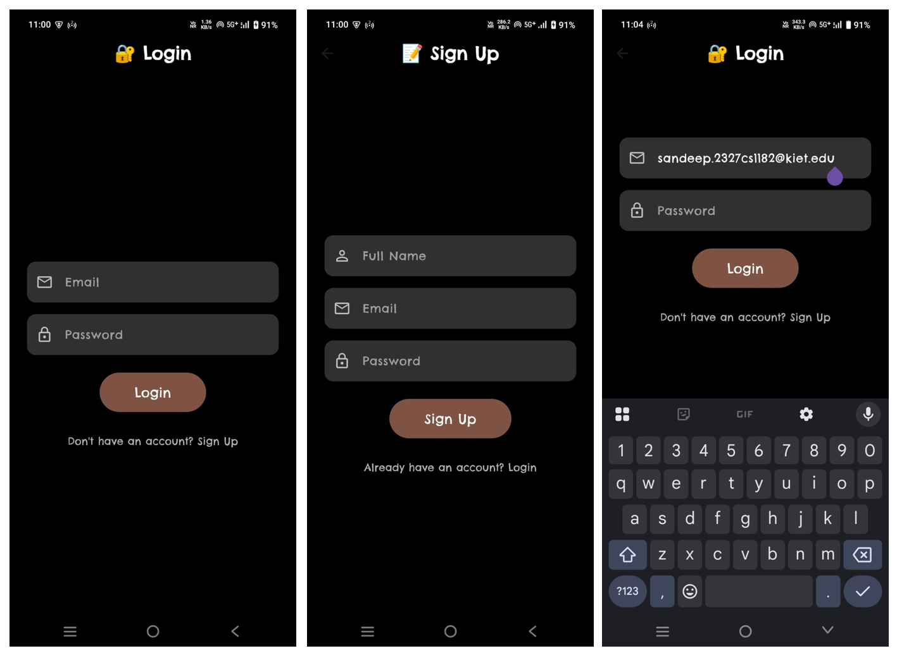
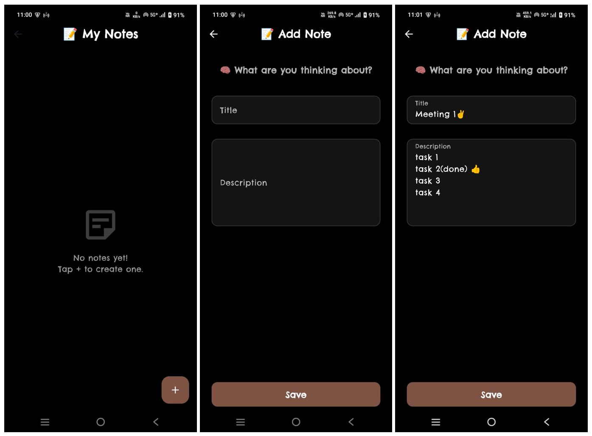
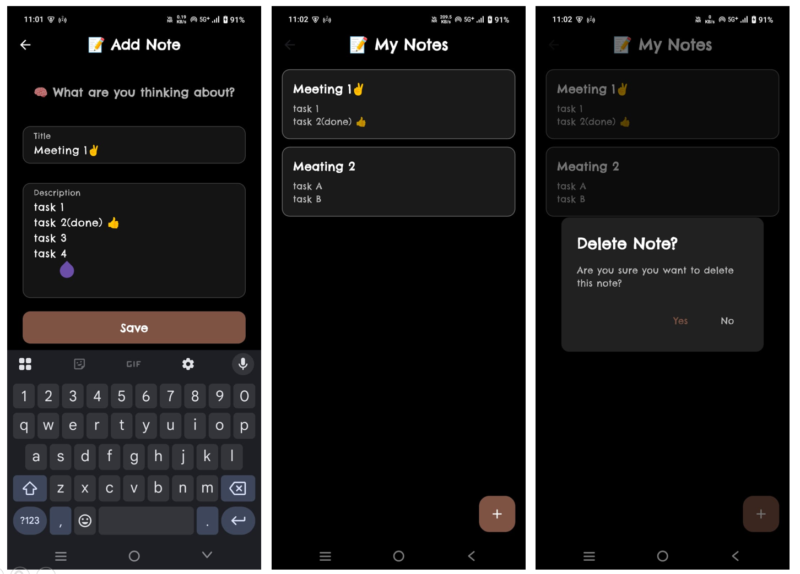

# 📒To-Do Flutter App

### 👨‍💻 Project by: **Sandeep Sisodiya**
### 🏢 Internship: **Oasis Infobyte Internship**

---

# 🗒️ NoteKeeper — Flutter Local Note App

**NoteKeeper** is a sleek, dark-themed Flutter application for quickly capturing, editing, and organizing personal notes entirely offline.

---
## 🖼️ Screenshots

Here are some previews of the app in action:

### 🔐 Login and SignUp Screen


### 📝 Notes Screen




---

## 🎯 Objective

Build a mobile note-taking app that:
- Provides **login** and **sign-up** flows with smooth custom animations.
- Offers an intuitive **dark-mode UI** for focused writing.
- Persists notes locally using SQLite so users never lose data.
- Demonstrates clean code architecture and reusable components for hackathon or portfolio showcase.

---

## 🛠️ Tools & Technologies

- **Flutter** & **Dart**: UI toolkit and language
- **Sqflite**: SQLite plugin for local persistence
- **Google Fonts**: Custom typography
- **Material Design**: Widgets and theming
- **Android Studio / VS Code**: Development IDE

---

## ⚙️ Steps Performed

1. **Project Setup**
    - Created a new Flutter project.
    - Added `sqflite` and `google_fonts` packages in `pubspec.yaml`.

2. **Authentication Screens**
    - Built `LoginScreen` and `SignUpScreen` with dark theme, custom text fields, and brown accent buttons.
    - Implemented two animation methods:
        - **SlideTransition** (slide from right/left)
        - **Fade + ScaleTransition**

3. **Notes Management**
    - Defined `Note` model (`note_model.dart`) with `id`, `title`, and `description`.
    - Created `DatabaseHelper` service for CRUD operations on a local SQLite database.
    - Built `NotesScreen` to list all notes, with “add” FAB and delete confirmation dialogs.
    - Created `NoteScreen` to add/edit a note, using `TextEditingController` to preload existing data.

4. **Reusable Components**
    - Developed `note_widget.dart` for displaying individual note cards.
    - Structured a consistent UI: rounded containers, semi-transparent backgrounds, and cohesive color palette.

---

## 📱 Screens Overview

| Screen            | Description                                     |
|-------------------|-------------------------------------------------|
| **Login**         | Email/password form, navigates to notes on success |
| **Sign-Up**       | Full name, email, password, navigates to login   |
| **Notes List**    | Displays saved notes, supports edit/delete       |
| **Note Editor**   | Add or update note title & description           |

---
## 🧑‍💼 Author

**Sandeep Sisodiya**  
Intern at **Oasis Infobyte**

---

## 🔧 How to Run

```bash
git clone https://github.com/your-username/notekeeper_flutter.git
cd notekeeper_flutter
flutter pub get
flutter run

